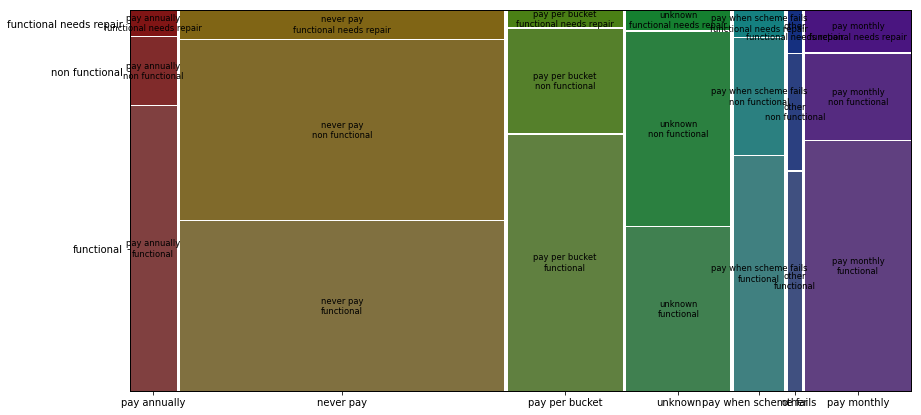
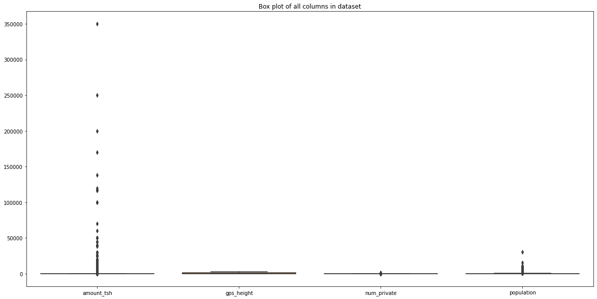
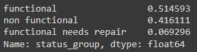
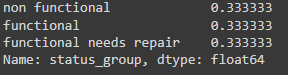
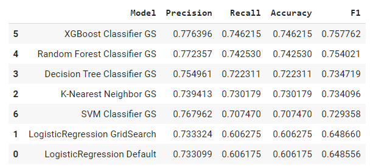
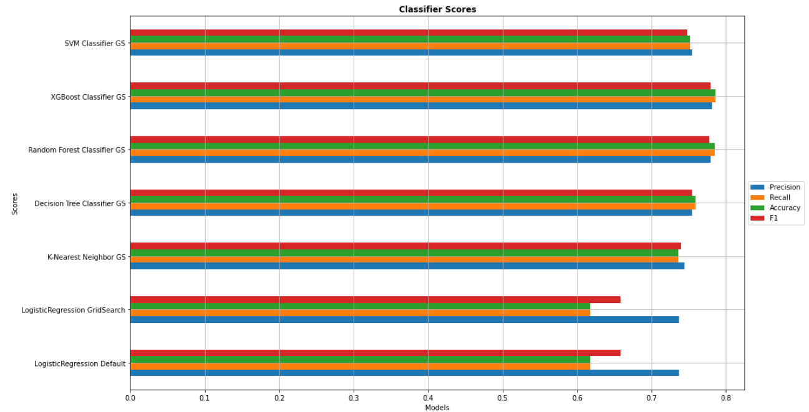
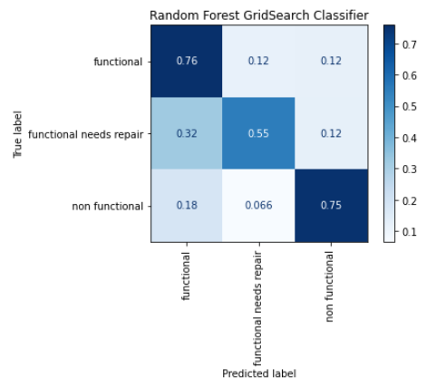
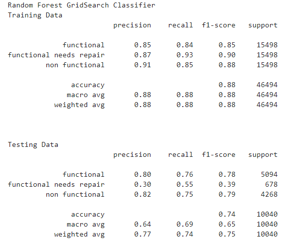
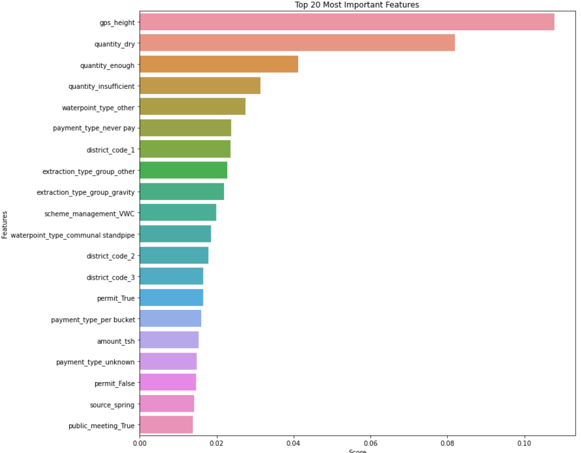

# Tanzania Water Point Classification

The purpose of this project is to take data provided by the Tanzania goverment about numerous water source points in the country and create a classifier that categorize new waterpoint data into three categories which are -

**'functional'** - waterpoint is operational

**'non functional'** - waterpoint is not operational and needs repair 

**'functional needs repair'** - waterpoint is operational but needs maintainence repair

### Repository Files
The following are folders and files you can find in this repository and their discription

1. content

        1.training_set_labels      - The dataset target

        2.training_set_values      - The dataset features

        3.test_set_values          - The features for prediction

        4.column_descriptions.txt  -  Discription of the features

    
 2. images            - images used in this README.md

 3. README.md         - discription of the project and repository

 4. presentation.pdf  - pdf of a powerpoint presentation meant for non-technical audience
 
 
### Process
For this project I followed OSEMN framework of-

1. Obtain the data

2. Scrub the data

3. Explore the data

4. Model the data

5. iNterpret the data

## Obtain - The Dataset

The dataset is from [drivendata.org](https://www.drivendata.org/competitions/7/pump-it-up-data-mining-the-water-table/). It is provided by Taarifa and the Tanzanian Ministry of Water. The raw data contains 40 features columns and 3 categories for the target.

## Scrub

For this project I made heavy use of the pandas library to manipulate and explore the dataset. I also made heavy use of sklearn libraries to model, evaluate and test the data.

The first thing I did is use pandas profiling to explore the data. I found that there were several highly correlated columns and some columns missing a massive amount of data.

I also made use of mosaicplot to look at several columns including the 'payment' column

We can see that pay annually has the most functional waterpoints, while never pay and unknown has the least.

After taking a look at the features descriptions, I saw that a few columns shared similars details

- scheme_management - Who operates the waterpoint
- scheme_name - Who operates the waterpoint

- management - How the waterpoint is managed
- management_group - How the waterpoint is managed

- extraction_type - The kind of extraction the waterpoint uses
- extraction_type_group - The kind of extraction the waterpoint uses
- extraction_type_class - The kind of extraction the waterpoint uses

- source - The source of the water
- source_type - The source of the water
- source_class - The source of the water
- water_quality - The quality of the water

- quality_group - The quality of the water
- quantity - The quantity of water
- quantity_group - The quantity of water.

- payment - What the water costs
- payment_type - What the water costs

- waterpoint_type - The kind of waterpoint
- waterpoint_type_group - The kind of waterpoint

I went through each column's unique values and value count to choose the ones the seems the most appropriate for the project.

After that, I took a look at the features containing geographical information:

- longitude - GPS coordinate
- latitude - GPS coordinate
- basin - Geographic water basin
- subvillage - Geographic location
- region - Geographic location
- region_code - Geographic location (coded)
- district_code - Geographic location (coded)
- lga - Geographic location
- ward - Geographic location

I got rid of the columns that seems redundant and the ones that had to many discrete unique values.

### Dealing with Outliers, Missing Data and Filler Values

I made use of boxplot from SeaBorn library to take a look at outliers

I used the IQR rule to cut off outliers.

Using value count, I found that several columns contain filler values-

- population - 0 ,1
- construction_year - 0
- management_group - unknown
- payment_type - unknown
- water_quality - unknown
- quantity - unknown

The population and construction_year columns are missing for about half the dataset. Using data imputation on these columns would drastically change the dataset, therefore they had to be dropped.

### Creating Dummy Variables and Splitting the Dataset 
I created dummy variables for the categorical columns and then split the data into testing and training sets. 

In my final dataset, I am left with 124 feature columns.

### Scaling the Dataset
I made use of StandardScaler for sklean library to scale all the data including the dummy variables.

###  Imbalanced Class

The biggest problem for the dataset is that the amount of data point for each target is different. 51% make up functional, 42% make up the non functional and only 7% for the functional need repair category which is around 2000 observation.

Original dataset

I made use of SMOTE(Synthetic Minority Oversampling Technique) from sklearn to create artifical datapoints.

## Method
For this project I took an iterative process of trying out six diffrent classifier models which were

1. Logistic Regression
2. K-Nearest Neighbour
3. Decision Tree Classifier
4. Random Forest Classifier
5. eXtreme Gradient Boosting (XGBoost)
6. Support Vector Machines (SVM)

I also made use of GridSearchCV from sklearn to search out the best values for the parameters. 

The performance metrics I will be using are Precision, Recall, Accuracy, and F1 Score. I will also be investigating the confusion matrix. I mainly paid attention to accuracy and F1-score. Below is a graph of model scores and table.

The accuracy and F1 scores for Random Forest and XGBoost are extremely similar with a slight edge to XGBoost but I chose to go with Random Forest as my final model. The reason for this is because Random Forest had a slightly better recall score for the 'functional needs repair' category which I believe is more important than the precision score for our purpose.

Another model that I also considered is Logistic Regression since it had a much better recall score for the 'functional needs repair' category. Since the purpose of this project is to help identify water points that need to be repaired having a high recall score for the 'nonfunctional' and 'functional needs repair' categories allows us to do that. A high recall score means we be able to identify more of the category but the downside is there will also be more false positives, which in our case means identifying functional water points as needing repair.

Ultimately I chose to prioritize the accuracy and F1 score over the recall score since having a lot of false-positive would waste manpower and budget for the Tanzanian government.

The accuracy score for the test data drop to 0.74 from 0.88 of the training data. The F1- score for the three categories is much lower for the testing dataset than the training dataset, especially for the 'functional needs repair' category. This is a category that all six classifier struggles with. The reason for this might be because of class imbalance problem. I used SMOTE to fixed the class imbalance but other methods might prove to be more effective.

### Interpreting the Model

To interpret the model I took a look at the top 20 most important features for our model. A lot of the features seems to be correct judging intuitively.

The second most important feature is shown to be the altitude of the well. It seems that the average altitude of nonfunctional waterpoints are lower than the functional ones.  It could be possible that the reason for this is because rural area in Tanzania are located at lower altitudes. Therefore, its not the altitude that is directly affecting the condition of the water point.

The quantity_dry, quantity_insufficient, and quantity_enough features are dummy variables and are obvious why they are ranked highly. A dry well or one without insufficient water would obviously be classifed as non functional.

Whether the waterpoint has a permit or not is also important in classifying the condition. 

Several waterpoint types and some extraction types also seems to be important in determining the condition. Perhaps the types that falls under some of these categories are not durable and should be avoided in the future.

A few District and regions are also included in the top twenty features. This warrants a closer inspection to see which districts have more nonfunctional water points and the reason why this might be.

### Improvements To Make

- Since using GridSearchCV take up a lot of computational time, I couldn't put in more parameters like I wanted. Searching out more parameters might improve the model performance.

- The model ability to predict functional needs repair is still lacking. I could try scrubbing the data in a diffrent way to make the model better.

- Try using a diffrent method of fixing class imbalance to see if it improve our model performance for the 'functional needs repair' category.

- Instead of getting rid of the population column completely, I could try filling it with population data searched out from the internet combined with either the subvillage or ward columns that contained too many unique values.

- Make the assumption that the 0 value in constructed year means that the water source is very old and replaced it with 1950. After that, derived an age column for the water sources.

- If predictive performance is the goal, then deep learning could be used since we do not need to make observations from the findings. Instead we can focus on getting the model to predict better.

